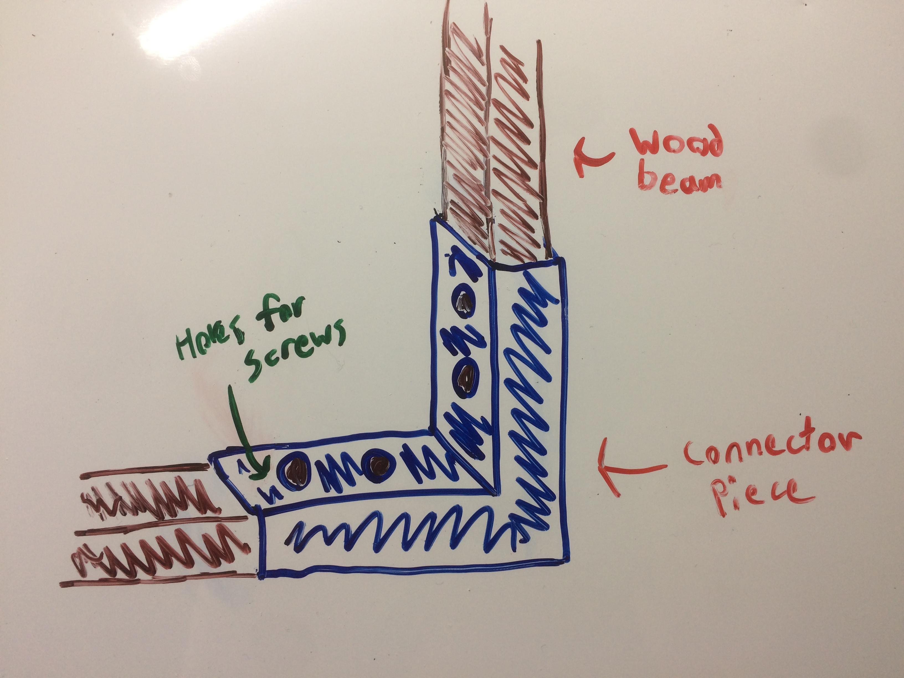
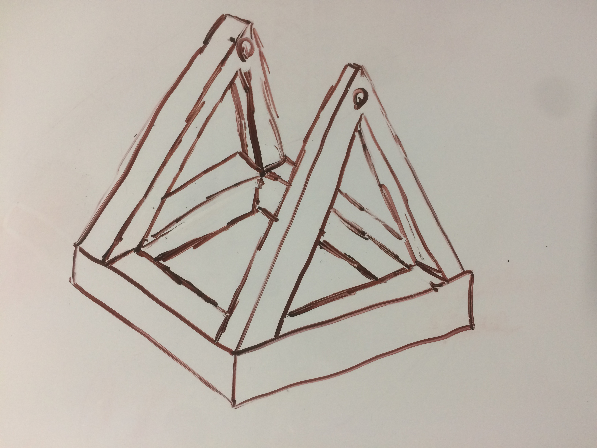
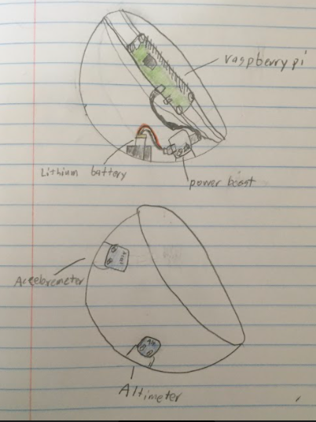

# EG4_Trebuchet
Trebuchet. Up the reds

## Planning

### Trebuchet 

#### Trebuchet Basics

Trebuchets are ancient siege weapons that utilize a counterweight to launch a projectile great distances. They are pretty much catapults except they use a counterweight rather than some sort of spring or rubber band. The use of a counterweight allows the payload to cover much greater distances than a traditional catapult; trebuchets also tend to have greater accuracy than catapults. In order to achieve maxium distance, the counterweight must be heavier than the payload. For our purposes, we figure a good starting range would be at least 100 feet; we want to possibly increase this goal depending on how initial testing goes. 

#### Trebuchet Physics

In general, they key for getting maxiumum range out of a trebuchet is by finding the right release angle for the pouch and the right mass for the counterweight. Obviously, having a heavier counterweight will increase the range. Finding the right release angle is a bit trickier. Looking at the graphics below, you can see that the component determining the pouch release angle is the finger. If we make the beam the horiziontal axis in relation to the finger, then a positive angle would result in a later release time while a negative angle would result in an earlier release time. 

  
  
  

[Link](https://www.real-world-physics-problems.com/trebuchet-physics.html) to pictures.

#### Trebuchet Build

To build the base for the trebuchet, we plan on using some wood beams and planks. To attach these together, we are going to use 3d printed joints that the pieces can slot into. Once slotted inside the 3d printed connectors, the beams can then be screwed into the connectors using some wood screws. 

Here's a quick sketch of what this is probably going to look like:

  
  

These types of connetors will allow us to connect different beams at whatever angles we need without having to cut a bunch of wood. Plus, they will offer a pretty strong connection between beams. 

### Payload Capsule

The capsule is going to be a spherical container which will hold the raspberry pi, a breadboard, accelerometer, altimeter, and the Lithium ion Polymer battery and this capsule is the payload of the trebuchet. These components will be wired up and fastened into the structure of the capsule so that they don’t move around and get damaged. The capsule will be wrapped in some sort of foam in order to make the impact with the ground softer for the materials inside. In the picture below you can see how the components will be organized in the capsule. The pi is going to be screwed into the beams going across the middle of the capsule. The lithium battery will be fastened to the wall and connected to the power booster which will be screwed into a mount on the wall and will be powering the pi. The altimeter and accelerometer will be mounted and screwed in on the other side of the capsule.

### Materials

| Material  | Quantity |
| ------------- | ------------- |
| Raspberry Pi Zero  | 1 |
| Accelerometer | 1 |
| Altimeter | 1 |
| Lipo Battery | 1 |
| Power booster | 1 |
| USB-A to microUSB power cable | 1 |
| Wood beams for trebuchet construcion | Many |
| Gyroscope module | 1 |

### Code 

#### Prep Table

| What?  | Why? | Have we learned this in the assignments? |
| ------------- | ------------- | ------------- |
| Take Acceleration Values  | So we can find the accerlation over time, and find speeds | Yes |
| Find Displacement | know distance,  | No |
| Take Altitude (and Max Altitude) | So we can find the max of the flight | No, but we have an altimeter |
| Find time in air | So we know how long it was in the air | No, but we have the tools |
| Find Max Velocity | know speed/velocity | Yes |
| Calculate Equation Model | So we can graph the flight, and know all we want about the flight/trajectory | No |
| Graph true flight on Webpage | So we can visually represent the flight -- in what it actually looked liked | Yes |
| Graph equation of flight on Webpage | So we can visually represent the flight -- in what the equation it followed looks like (both graphs should be similar) | No |
| Profit | Become a government contractor for Trebuchets| Of Course |

#### Pseudo Pseudo Code
    
      When launch button pressed
            while IN AIR:
            
              Record height, acceleration, time
              sleep( small delay )
              
      
            while Not IN AIR:
              calculate equation model
              graph equation
              put equation on webpage
              put data on webpage

### Timeline

| Week | Lukas | Owen | Graham |  
| ------------- | ------------- | ------------- | ------------- |
| Feb 22 - Mar 1 | Get dimensions, build rough structure in CAD | Research trebuchet physics, find optimal design | Build Code Shell - Pseudocode   |
| Mar 1 - Mar 8 | Plan, rough CAD | Research trebuchet physics, find optimal design | Wire all needed devices, make sure they work  |
| Mar 8 - Mar 15 | Build capsule | Research trebuchet physics, find optimal design | Create Variables and Attached Devices |
| Mar 15 - Mar 22 | Build capsule | Trebuchet CAD | Get While Altitude Loop looping and appending to raw arrays  |
| Mar 22 - Mar 29 | Build capsule | Trebuchet CAD | get raw arrays converted to x and y final arrays  |
| Mar 29 - Apl 5 | Build capsule | Trebuchet CAD | Extra Time Built in - Mid-Project  |
| Apl 5 - Apl 12 | Do capsule electronics | Trebuchet CAD | Plotting the Flight of the Graph  |
| Apl 12 - Apl 19 | Do capsule electronics | Trebuchet CAD | Find the equation of the graph   |
| Apl 26 - May 3  | Do capsule electronics | Trebuchet CAD | Get all of the data on to a Flask Site   |
| May 3 - May 10  | Trebuchet bulding | Build & test | Get all of the data on to a Flask Site  |
| May 10 - May 17  | Trebuchet bulding | Build & test | Integrate code/wires to launch capsule   |
| May 17 - May 24  | Trebuchet bulding | Re-design | Extra Time built in  |
| May 24 - May 31  | Extra time built in | Re-design | Extra Time built in   |
| May 31 - End of Year  | Extra time built in | Extra time built in |Extra Time built in    |

### All Links

[Cole and Dani's Pi in the Sky Project](http://wiki.chssigma.com/index.php?title=Dani_and_Cole%27s_Pi_in_the_Sky)

[Trebuchet Physics in Real Life](https://www.real-world-physics-problems.com/trebuchet-physics.html)

[Array to Quadratic Equation](https://numpy.org/doc/stable/reference/generated/numpy.polyfit.html)

[Curve Fitting with Python](https://machinelearningmastery.com/curve-fitting-with-python)
