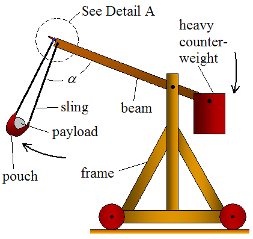
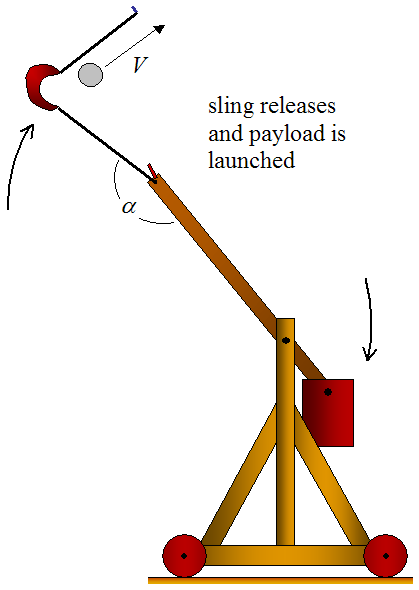

# EG4_Trebuchet
Trebuchet. Up the reds

## Planning

### Trebuchet Basics

  
  

[Link](https://www.real-world-physics-problems.com/trebuchet-physics.html) to pictures.

### Materials

| Material  | Quantity |
| ------------- | ------------- |
| Raspberry Pi Zero  | 1 |
| Accelerometer | 1 |
| Altimiter | 1 |
| Lipo Battery | 1 |
| Power booster | 1 |
| USB-A to microUSB power cable | 1 |

### Code Goals

| What?  | Why? |
| ------------- | ------------- |
| Take Accerlation Values  | So we can find the equation of the flight|
| Take Altitude | So we can find the equation of the flight |
| Find time in air | So we can find the equation of the flight |
| Find Displacement | So we can find the equation of the flight, and know distance  |
| Find Max Velocity | So we can find the equation of the flight, and know speed/velocity |
| Calculate Equation Model | So we can graph the flight, and know all we want about the flight/trajectory |
| Graph equation on Webpage | So we can visually represent the flight |
| Profit | Become a government contractor for Trebuchets|

