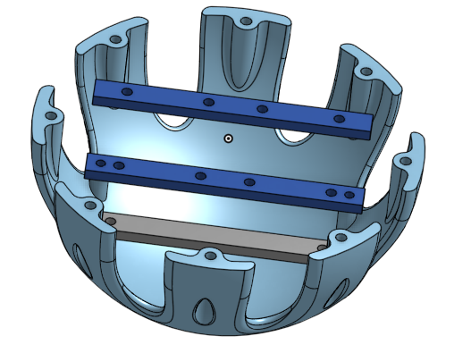
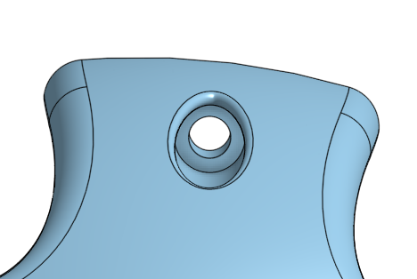
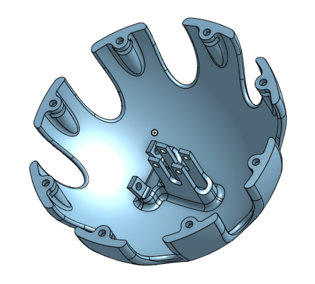
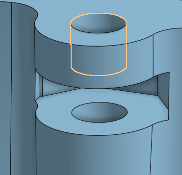
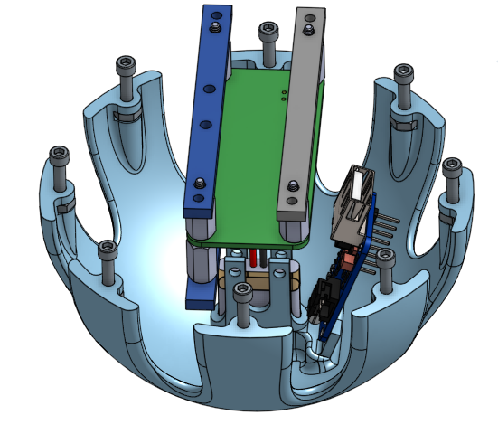
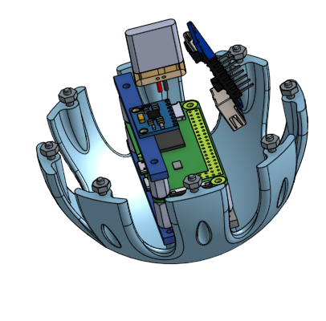
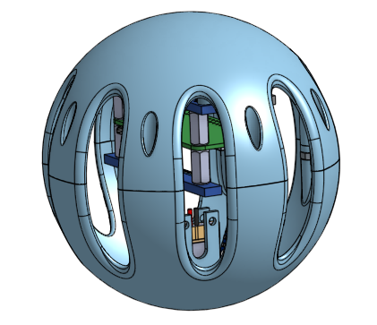

# EG4_Trebuchet
Trebuchet. Up the reds
|[CAD](https://github.com/omckenn37/EG4_Trebuchet/blob/main/README.md#cad)|[Code](https://github.com/omckenn37/EG4_Trebuchet/blob/main/README.md#code)|[Assembly](https://github.com/omckenn37/EG4_Trebuchet/blob/main/README.md#physical-assembly)|[Results](https://github.com/omckenn37/EG4_Trebuchet/blob/main/README.md#results)|
|---|---|---|---|
## CAD
### Capsule
#### Top Circle:

  
  

This is the top half of the sphere when assembling. This will contain the pieces that supports the raspberry pi, altimeter, and gyro/accelerometer. The three rectangular prisms are pieces we converted to laser cut peices so we can try to save as much material as we can. All those pieces will be held in place by standoffs and at the bottom screwed in directly into the sphere structure. The right image the slot that the screw will insert in and go threw to the other half of the sphere and screw the together. This is drilled into the sphere so there is nothing perturding from the spherical shape.

#### Bottom Circle:

  
  

This is the bottom half of the sphere when assembling. This will contain the battery and power booster. The bottom ovalish extruded piece is what will hold the battery it has been made to match the shape with a bit of padding. The piece to the side of that is the holder of the power booster it has been made so it is at an angle so it saves space by optimizing on the curved shape of a sphere. The right image is an extrusion along the inside of the capsule walls it forms a correlating slot that will direct the screw into a gap where we can slide the nut into and screw the capsule together.

#### Assembly:

  
  
  

The first image displays the assembly without the top circle and displays the pi components floating in the air and you can see the screws going into their slots and can see the battery and power booster screwed in under them. The second picture displays the assembly without the bottom circle and shows the screwed-in battery and power booster while the pi components are floating and you can see the floating nuts and the screw extruding from its slot. Lastly, the final image is the completed assembly you can see the entire assembly we extruded the sides to make an almost Wiffle-ball-like shape so that it saves as much material as possible and we also added the screw and nut portion without messing with the sphere shape.
 
### Trebuchet
Owen make your cad sections as 4 hastags 

#### Basic Joints and Connection Pieces
Originally, the plan for our joints and other various connection pieces was to make 4-6 3d printed joints that would join 2-3 pieces of alumminum extrusion together. We had originally decided to make the joints fully 3d printed as ABS material is quite stronger than acrylic. However, after testing the strength of a few laser cut joints, we realized they would probably be strong enough if we paired up 2 acrylic pieces on each joint and made sure to provide enough mounting holes. As you can see in the pictures above, there are two variations of laser cut joints; one takes a boomerang-like shape and is shaped in a 68 degree angle, while the other joint is meant to join two extrusion pieces at a 90 degree angle. To allow for maximum strength, we use two joint pieces for each connection, one on each side of the alumminum bars. 

#### Bearing Joints
These joints are the only 3d printed joints that we used on our trebuchet. They had to be 3d printed as we wouldn't have been able to properly integrate the bearing with laser cut pieces. These joints were built on a 44 degree and and have a circular cut out of them at the top to allow a bearing to be pushed in. 

#### Finger Piece
The finger piece is the component of the trebuchet that determines the launch angle of the payload. Essentially, the angle at which the release string is attached to the finger piece determines at what time during the launch the string releases, impacting the launch angle of the payload. Because of this, we felt that we should make this piece able to swivel along one axis so that during testing, we could adjust the release angle with ease. The metal finger is able to swivel roughly 45 degrees, giving us plenty of room for adjustments. 

#### Release Mechanism
The release mechanism is comprised of 3 3D printed linkages, a metal rod, and a servo. To set up the launch mechanism, we will pull astring around the mtal rod and connect it permanantly to the other side of the trebuchet. When the servo rotates, the metal rod is pulled out which creates space for the string to release. Additionally, we will add a simple raspberry pi control box that will allow us to control the servo remotely, meaning we can hook up a launch button to our flask site.

#### Full Trebuchet Body

### Lessons Learned: 
First Off, Spheres are very annoying to work with because for every extrusion you have to make a plane since there is no flat surface that you can select on a sphere. This was our first project with Onshape so we did learn some new functions that we didn't know. I have used a lot of circular patterns and mirrors in this assignment and how to use the in sketch version which does not bring up a menu it creates pop-ups similar to a smart dimension. A cool feature we discovered is the app store that we never really noticed: the App Store, although we haven't used it much and a lot of the programs aren't free, there do seem to be some possible programs that can render your CAD to get better images for documentation and also programs similar to SolidWorks stress test. Also, we learned how to make the drawings used to laser cut parts. Another thing I learned is using a bit of trigonometry to get chamfers to be at an angle you desire.

## Code

## Physical Assembly

## Results
