# EG4_Trebuchet
Trebuchet. Up the reds

## Table of Contents

- [Trebuchet Design](https://github.com/omckenn37/EG4_Trebuchet/blob/main/README.md#trebuchet-design)
  * [Ratios](https://github.com/omckenn37/EG4_Trebuchet/blob/main/README.md#ratios)
  * [Simulation](https://github.com/omckenn37/EG4_Trebuchet/blob/main/README.md#simulation)
- [CAD](https://github.com/omckenn37/EG4_Trebuchet/blob/main/README.md#cad)
  * [Capsule](https://github.com/omckenn37/EG4_Trebuchet/blob/main/README.md#capsule)
    + [Top Shere](https://github.com/omckenn37/EG4_Trebuchet/blob/main/README.md#top-sphere)
    + [Bottom Sphere](https://github.com/omckenn37/EG4_Trebuchet/blob/main/README.md#bottom-sphere)
    + [Components](https://github.com/omckenn37/EG4_Trebuchet/blob/main/README.md#components)
    + [Assembly](https://github.com/omckenn37/EG4_Trebuchet/blob/main/README.md#assembly)
    + [Reflections](https://github.com/omckenn37/EG4_Trebuchet/blob/main/README.md#reflections)
  * [Trebuchet](https://github.com/omckenn37/EG4_Trebuchet/blob/main/README.md#trebuchet)
    + [Basic Joints and Connection Pieces](https://github.com/omckenn37/EG4_Trebuchet/blob/main/README.md#basic-joints-and-connection-pieces)
    + [3D Printed Joints](https://github.com/omckenn37/EG4_Trebuchet/blob/main/README.md#3d-printed-joints)
    + [Finger Piece](https://github.com/omckenn37/EG4_Trebuchet/blob/main/README.md#finger-piece)
    + [Release Mechanism](https://github.com/omckenn37/EG4_Trebuchet/blob/main/README.md#release-mechanism)
    + [Axle Cap](https://github.com/omckenn37/EG4_Trebuchet/blob/main/README.md#axle-cap)
    + [Other Components](https://github.com/omckenn37/EG4_Trebuchet/blob/main/README.md#other-components)
    + [Full Trebuchet Assembly](https://github.com/omckenn37/EG4_Trebuchet/blob/main/README.md#full-trebuchet-assembly)
- [Trebuchet Simulation](https://github.com/omckenn37/EG4_Trebuchet/blob/main/README.md#trebuchet-simulation)
- [Code](https://github.com/omckenn37/EG4_Trebuchet/blob/main/README.md#code)
- [Physical Assembly](https://github.com/omckenn37/EG4_Trebuchet/blob/main/README.md#physical-assembly)
- [Results](https://github.com/omckenn37/EG4_Trebuchet/blob/main/README.md#results)

## Trebuchet Design

### Ratios

The two most important ratios for trebuchet design are the arm ratio and the weight ratio. To optimize launch distance, the ratio between the short arm and the long arm must be 5:1. For our trebuchet, we opted for a long arm of 900mm and a short arm of 180mm, giving us this 5:1 ratio. Additionally, the ratio between the payload and the counterweight must be roughly 133:1. This means that if our launch capsule was 1 pound, our counterweight would have to be 133 pounds. During our assembly phase of the capsule, we found that the capsule, when loaded with all the proper components, weighed about 135 grams. This means that our counterweight would have to weigh somewhere between 30 and 40 pounds as ```135 * 133 = 17955 grams or ~39.5 pounds```. We decided to use a counterweight with a weight of 35 pounds because we felt like this would still give us decent launch distance without physically straining our trebuchet structure.

### Simulation

In order to figure out the most optimized design for our trebuchet, we used on online trebuchet simulation called [Virtual Trebuchet](http://www.virtualtrebuchet.com/). This simulation allows you to input numerous trebuchet parameters including sling length, arm length, launch height, and much more. Once those parameters are filled, you are able to run the simulation and see the trebuchet actually launch. Additionally, the simulation provides an estimate for payload displacement and initial launch velocity. 
Here's a picture of what the simulation looks like with all the somewhat correct parameters:

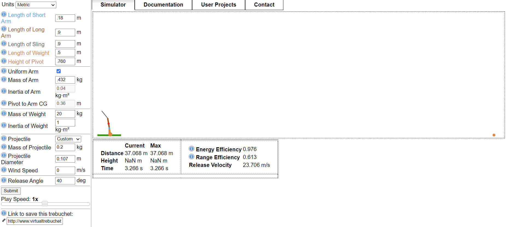

If you want to try virtually launching our trebuchet in this simulation, click [this link](http://www.virtualtrebuchet.com/#simulator_%24id=003&LengthArmShort=.18&LengthArmLong=.9&LengthSling=.9&LengthWeight=.5&HeightOfPivot=.812&MassWeight=20&MassProjectile=0.2&MassArm=.432&ReleaseAngle=40&uniformArm=true&ProjectileDiameter=0.107&InertiaArm=0.04&PivotToArmCG=0.36&InertiaWeight=1&CalculateDrag=true&WindSpeed=0&projectile=custom&customProjectile=true&units=metric&advancedMode=true&playSpeed=1&customPlaySpeed=0.15&length=m&mass=kg&angle=deg&velocity=m%2Fs&inertia=kg%C2%B7m%C2%B2&time=s&=&distance=37.85031800461218). It should open up a new simulation with the parameters of our trebuchet.

This online simulation was super useful because it helped us tune all of the various values without having to do real world testing which saved us a lot of time and effort. Many trebuchet parameters such as sling length or counterweight length don't have super standard ratios, meaning they are highly dependent on the design of the trebuchet. This makes these values hard to predict but easy to tune and figure out in a sumulation like this. 

## CAD
### Capsule
#### Top Sphere:
<p float="left">
  
  
</p>

This is the top half of the sphere when assembling. This will contain the pieces that supports the raspberry pi, altimeter, and gyro/accelerometer. The three rectangular prisms are pieces we converted to laser cut peices so we can try to save as much material as we can. All those pieces will be held in place by standoffs and at the bottom screwed in directly into the sphere structure. The right image the slot that the screw will insert in and go threw to the other half of the sphere and screw the together. This is drilled into the sphere so there is nothing perturding from the spherical shape.

#### Bottom Sphere
<p float="left">
  
  
</p>

This is the bottom half of the sphere when assembling. This will contain the battery and power booster. The bottom ovalish extruded piece is what will hold the battery it has been made to match the shape with a bit of padding. The piece to the side of that is the holder of the power booster it has been made so it is at an angle so it saves space by optimizing on the curved shape of a sphere. The right image is an extrusion along the inside of the capsule walls it forms a correlating slot that will direct the screw into a gap where we can slide the nut into and screw the capsule together.

#### Components 
##### Raspberry Pi
The raspberry Pi is positioned in the center of the top circle to try and create a central mass. This location also makes it easier to wire up all the components to the Pi. The Pi however, is one of our major issues, we've been troubleshooting how to give wifi to the pi while it's hurling through the air. We were considering setting up hot spots and it seems to be our only option.

##### Gyro/accelorometer
This piece is vital to our project's code working as intended. The capsule is obviously going to have a lot of rotational motion and the gyro allows us to determine directional acceleration almost as if it wasn't spinning something that would be impossible without it. It has been located as central as we can get it so our readings can be as accurate as possible.

##### Battery
The battery is positioned at the bottom of the bottom sphere, It's shape is a little akward so it's hard to fit it in anywhere else but it is set up so screws can go through its mount and lock it into place.

##### Power Booster
This is required to get the battery to power the pi. It is positioned right next to the battery so that it is in range of battery's wire. As mentioned previously, the power booster is at angle thanks to chamfer and this is to use the space as best we can and also because it has a rather long wire that attaches to the Pi and this angle helps us rap it around the outside so it won't mess with other components.

##### Screws, Standoffs, and Nuts
We used a lot of Female-Male Standoffs to setup the pi and gyro because it allowed us to use laser cut pieces instead of 3D printed Pieces. One issue with the design is were those laser cut pieces are screwed in; It was a bit of a tight fit and we are screwing into the 3D printed which isn't exactly the most efficient. The actual connection of spheres has a very sturdy connection, there are 8 slots on each sphere respectively. On the top sphere there are the screw slots which is an extruded cut the size of the screw head and then it changes near the end to an extruded cut the width of thread. On the bottom sphere there is a gap where the nuts are placed it is extruded all the way through so that when assembling it's easier to adjust the nuts if needed and it also has an extruded cut the width of the thread.
#### Assembly
<p float="left">
  
  
  
  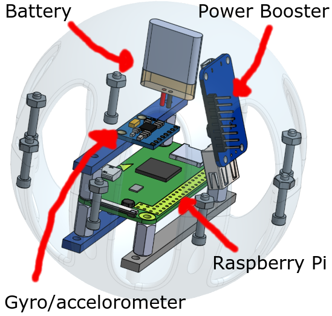
</p>

The first image displays the assembly without the top circle and displays the pi components floating in the air and you can see the screws going into their slots and can see the battery and power booster screwed in under them. The second picture displays the assembly without the bottom circle and shows the screwed-in battery and power booster while the pi components are floating and you can see the floating nuts and the screw extruding from its slot. Lastly, the final image is the completed assembly you can see the entire assembly we extruded the sides to make an almost Wiffle-ball-like shape so that it saves as much material as possible and we also added the screw and nut portion without messing with the sphere shape.
<br>

#### Reflections 
First Off, Spheres are very annoying to work with because for every extrusion you have to make a plane since there is no flat surface that you can select on a sphere. This was our first project with Onshape so we did learn some new functions that we didn't know. I have used a lot of circular patterns and mirrors in this assignment and how to use the in sketch version which does not bring up a menu it creates pop-ups similar to a smart dimension. A cool feature we discovered is the app store that we never really noticed: the App Store, although we haven't used it much and a lot of the programs aren't free, there do seem to be some possible programs that can render your CAD to get better images for documentation and also programs similar to SolidWorks stress test. Also, we learned how to make the drawings used to laser cut parts. Another thing I learned is using a bit of trigonometry to get chamfers to be at an angle you desire.

---

### Trebuchet

#### Basic Joints and Connection Pieces

<p float="left">
  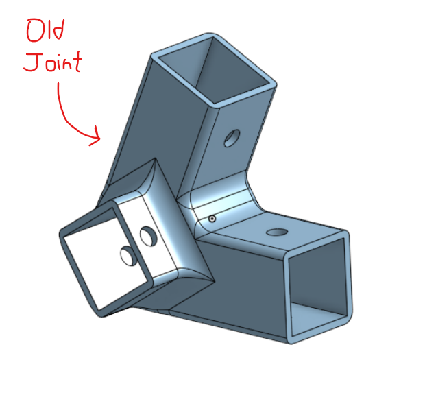
  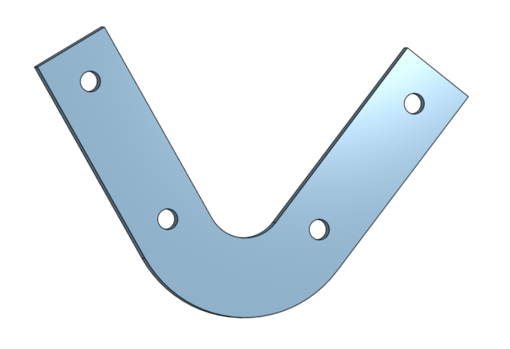
  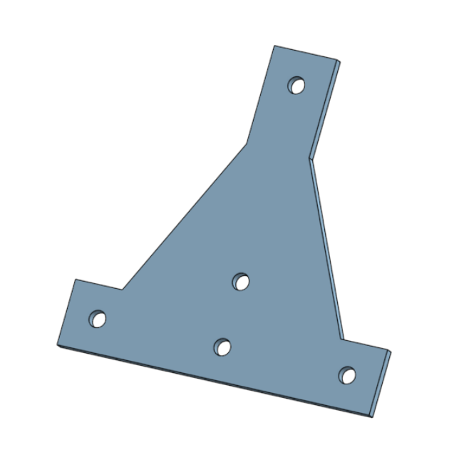
  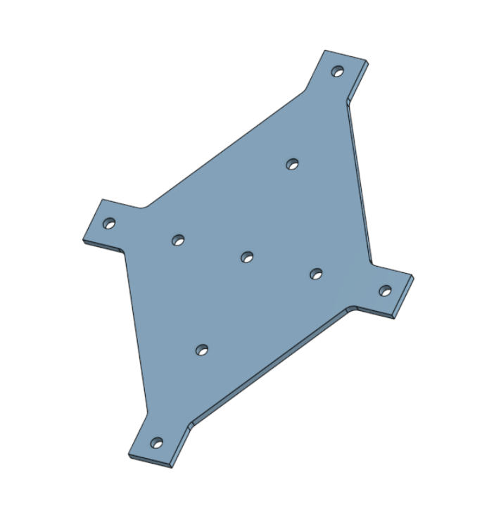
</p>

Originally, the plan for our joints and other various connection pieces was to make 4-6 3d printed joints that would join 2-3 pieces of alumminum extrusion together. We had originally decided to make the joints fully 3d printed as ABS material is quite stronger than acrylic. However, after testing the strength of a few laser cut joints, we realized they would probably be strong enough if we paired up 2 acrylic pieces on each joint and made sure to provide enough mounting holes. As you can see in the pictures above, there are 3 different types of laser cut joints that we used; the left-most takes a boomerang-like shape and is curved at a 68 degree angle, the middle joint allows the pivot beam to connect to the cross beam, and the joint on the right allows two beams to be joined at a 90 degree angle. To allow for maximum strength, we use two joint pieces for each connection, one on each side of the alumminum bars. 

#### 3D Printed Joints

<p float="left">
  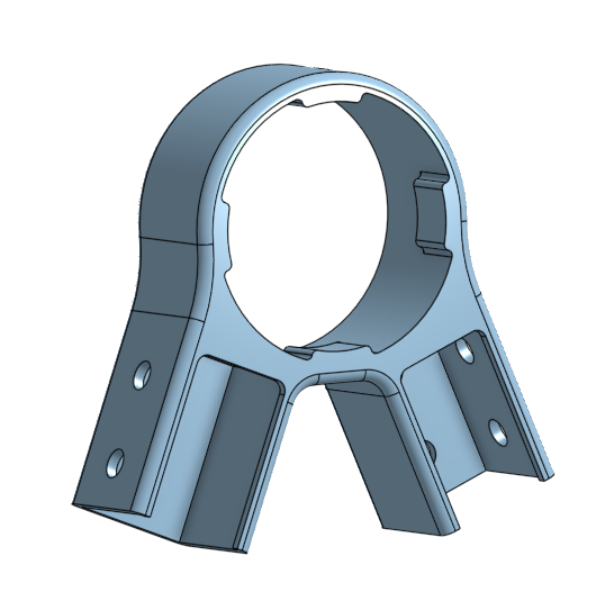
  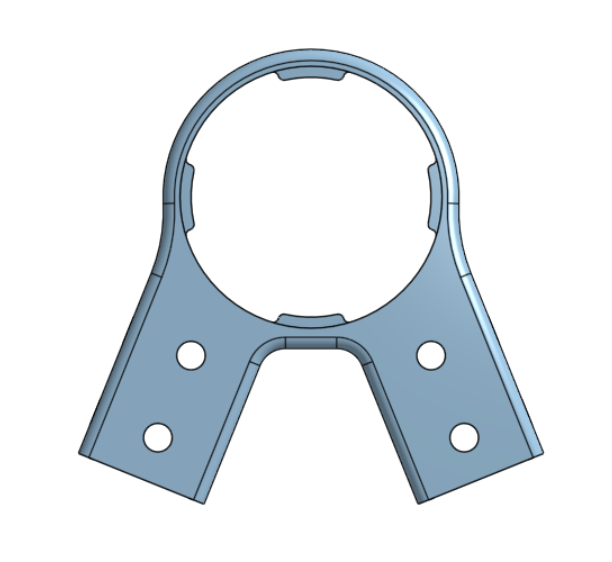
  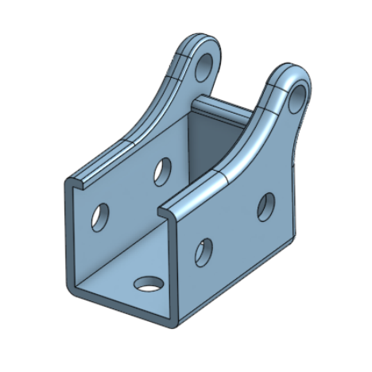
</p>

These joints are the only 3d printed joints that we used on our trebuchet. TThe left and center pictures show the bearing joing. This piece takes in two beam connections at a 44 degree angle and connects them together while additonally allowing a bearing to be pushed into the circular cutout. This specifc joint had to be 3d printed as we wouldn't have been able to properly integrate the bearing with laser cut pieces. The picture on the right shows our counterweight holder. We opted to 3D print this piece rather than laser cut it as it will be directly holding up our counterweight, which is rouhgly 35 pounds. To make sure that this piece didn't break or shatter during testing, we figured 3D printing it was a smart move. 

#### Finger Piece

<p float="left">
  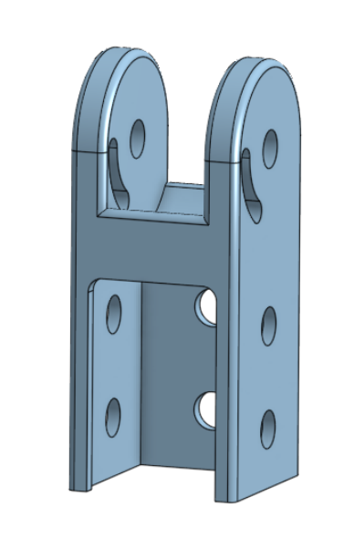
  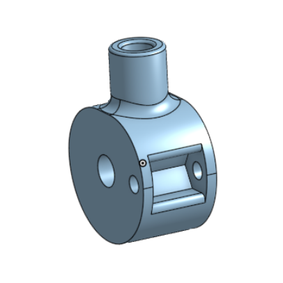
  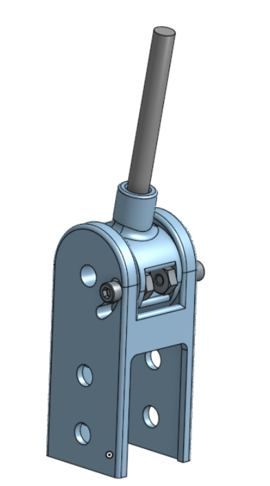
  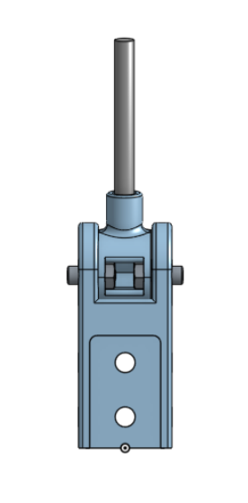
</p>

The finger piece and finger assembly connects to the long arm of the pivot beam an and allows the angle of release for the pouch to be adjusted. Essentially, the angle at which the release string is attached to the finger piece determines at what time during the launch the string releases, impacting the launch angle of the payload. Because of this, we felt that we should make this piece able to swivel along one axis so that during testing, we could adjust the release angle with ease. The metal finger is able to swivel roughly 45 degrees, giving us plenty of room for adjustments. 

#### Release Mechanism

<p float="left">
  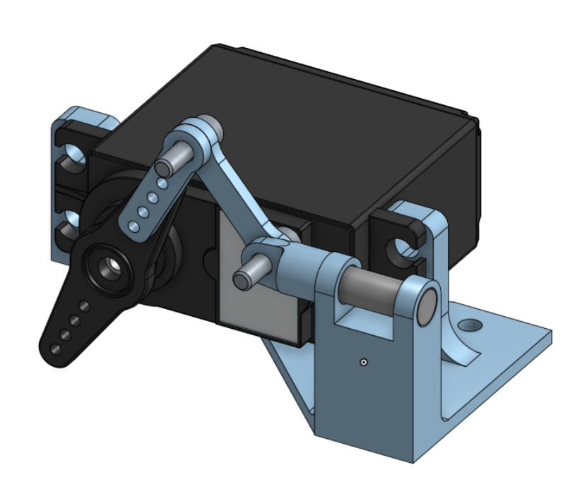
  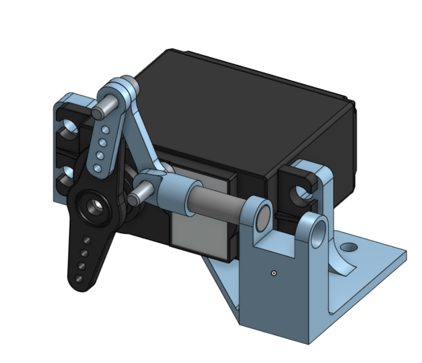
</p>

The release mechanism is comprised of 3 3D printed linkages, a metal rod, and a servo. To set up the launch mechanism, we will pull astring around the mtal rod and connect it permanantly to the other side of the trebuchet. When the servo rotates, the metal rod is pulled out which creates space for the string to release. Additionally, we will add a simple raspberry pi control box that will allow us to control the servo remotely, meaning we can hook up a launch button to our flask site.

#### Axle Cap

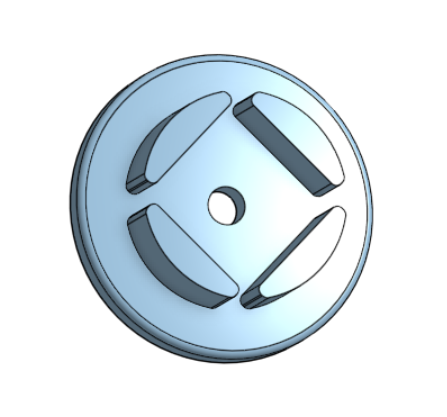

The axle cap allows the 20x20mm extrusion to rotate freely inside the main swivel bearings. The piece connects to the extrusion with one screw and essentially converts the cube shape of the beam into a circular shape that fits into the bearing, allowing the beam to rotate inside the bearing which gives our launch very smooth movement. 

#### Other Components

##### 20x20mm Alumminum Extrusion

Our main frame of the trebuchet was built using 20x20mm alumminum extrusion that we found in the back of the lab. Originally, we planned on buying wooden planks but upon finding these we figured they were a much better option considering they were significantly smaller yet very strong. To construct our frame, we cut this extrusion into 1100mm, 800mm, 600mm, 400mm, and 207mm lengths. 

##### Nuts & Bolts

To connect the alumminum extrusion to our various laser cut and 3D printed components, we used M5 6mm bolts and M5 T-slot nuts that we found with the alumminum extrusion. These nuts and bolts allowed us to have incredibly secure connection between parts and helped us achieve a very rigid trebuchet structure. 

##### Bearings

To make sure that our pivot arm had smooth movement, we decided to incorporate bearing into our design. We ended up using 30x47x9mm bearings as they allowed for the extrusion to fit inside of them with a bit of wiggle room, meaning we could design and use a piece like the axle capt to make sure the beams were able to rotate freely inside the bearings.

##### Steel Rod

We used 5mm steel rod for the finger as well as to hold our counterweight string as it had a small diameter and could hold quite a bit of weight. 

#### Full Trebuchet Assembly

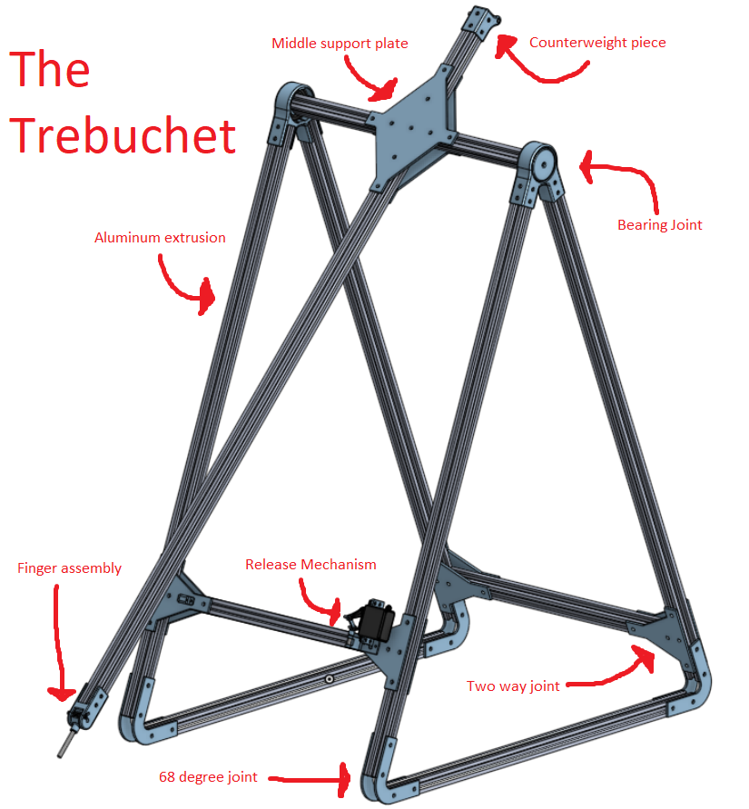

The final CAD assembly of the trebuchet combines all of the listed components into one seamless assembly. The counterweight and payload pouch are not included in the CAD as they are very difficult to model, but they would connect to the finger assembly and the counterweight piece. 
The final CAD assembly of the trebuchet combines all of the listed components into one seamless assembly. The counterweight and payload pouch are not included in the CAD as they are very difficult to model, but they would connect to the finger assembly and the counterweight piece. 
The final CAD assembly of the trebuchet combines all of the listed components into one seamless assembly. The counterweight and payload pouch are not included in the CAD as they are very difficult to model, but they would connect to the finger assembly and the counterweight piece. 
The final CAD assembly of the trebuchet combines all of the listed components into one seamless assembly. The counterweight and payload pouch are not included in the CAD as they are very difficult to model, but they would connect to the finger assembly and the counterweight piece. 
The final CAD assembly of the trebuchet combines all of the listed components into one seamless assembly. The final CAD assembly of the trebuchet combines all of the listed components into one seamless assembly. The final CAD assembly of the trebuchet combines all of the listed components into one seamless assembly. 


<p float="left">
  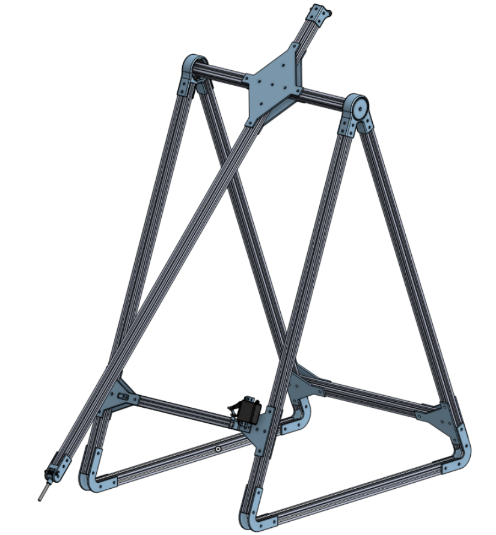
  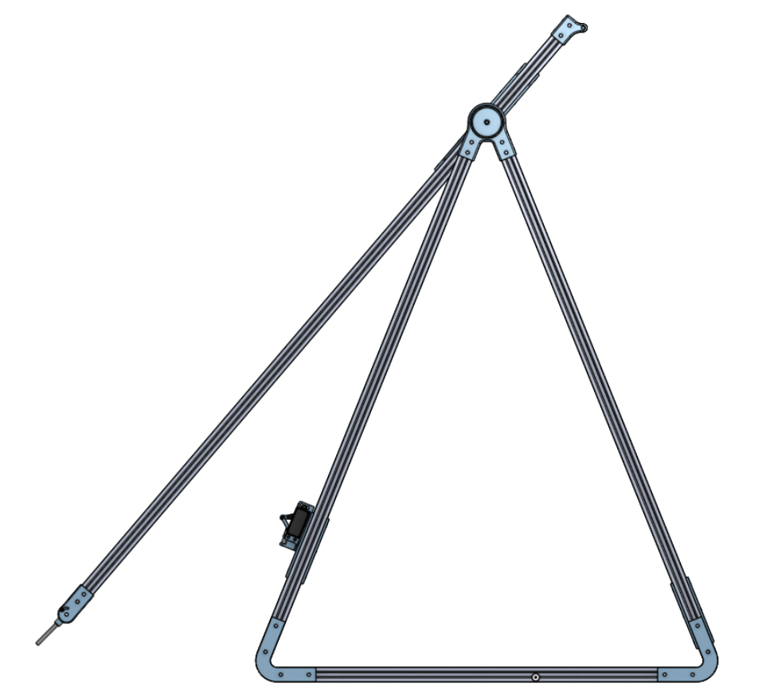
  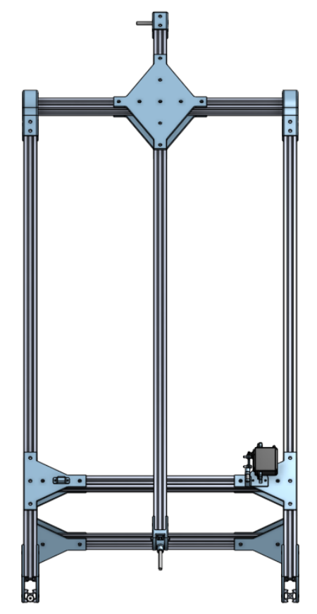
  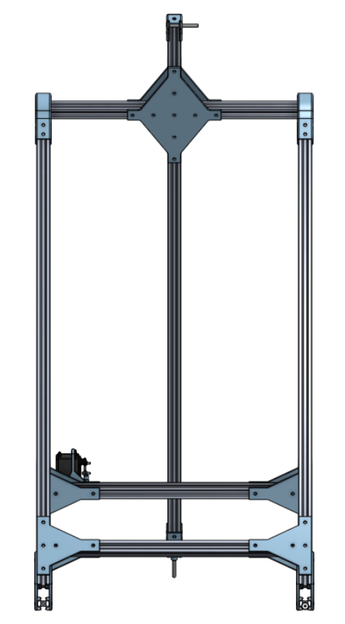
  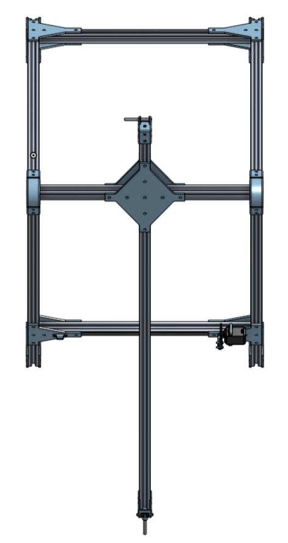
</p>


---


## Code

### FuncAngleOMeter

<details>
<summary>Code</summary>
<!--All you need is a blank line-->

**Python** *Code*
```python
#Connections
#MPU6050 - Raspberry pi
#VCC - 5V  (2 or 4 Board)
#GND - GND (6 - Board)
#SCL - SCL (5 - Board)
#SDA - SDA (3 - Board)


from Kalman import KalmanAngle
import smbus			#import SMBus module of I2C
import time
import math

from mpu6050 import mpu6050
myAccel = mpu6050(0x68)
myAccel_data = myAccel.get_accel_data()

kalmanX = KalmanAngle()
kalmanY = KalmanAngle()

RestrictPitch = True	#Comment out to restrict roll to ±90deg instead - please read: http://www.freescale.com/files/sensors/doc/app_note/AN3461.pdf
radToDeg = 57.2957786
kalAngleX = 0
kalAngleY = 0
#some MPU6050 Registers and their Address
PWR_MGMT_1   = 0x6B
SMPLRT_DIV   = 0x19
CONFIG       = 0x1A
GYRO_CONFIG  = 0x1B
INT_ENABLE   = 0x38
ACCEL_XOUT_H = 0x3B
ACCEL_YOUT_H = 0x3D
ACCEL_ZOUT_H = 0x3F
GYRO_XOUT_H  = 0x43
GYRO_YOUT_H  = 0x45
GYRO_ZOUT_H  = 0x47


#Read the gyro and acceleromater values from MPU6050
def MPU_Init():
	#write to sample rate register
	bus.write_byte_data(DeviceAddress, SMPLRT_DIV, 7)

	#Write to power management register
	bus.write_byte_data(DeviceAddress, PWR_MGMT_1, 1)

	#Write to Configuration register
	#Setting DLPF (last three bit of 0X1A to 6 i.e '110' It removes the noise due to vibration.) https://ulrichbuschbaum.wordpress.com/2015/01/18/using-the-mpu6050s-dlpf/
	bus.write_byte_data(DeviceAddress, CONFIG, int('0000110',2))

	#Write to Gyro configuration register
	bus.write_byte_data(DeviceAddress, GYRO_CONFIG, 24)

	#Write to interrupt enable register
	bus.write_byte_data(DeviceAddress, INT_ENABLE, 1)


def read_raw_data(addr):
	#Accelero and Gyro value are 16-bit
        high = bus.read_byte_data(DeviceAddress, addr)
        low = bus.read_byte_data(DeviceAddress, addr+1)

        #concatenate higher and lower value
        value = ((high << 8) | low)

        #to get signed value from mpu6050
        if(value > 32768):
                value = value - 65536
        return value


bus = smbus.SMBus(1) 	# or bus = smbus.SMBus(0) for older version boards
DeviceAddress = 0x68   # MPU6050 device address

MPU_Init()

time.sleep(1)
#Read Accelerometer raw value
accX = read_raw_data(ACCEL_XOUT_H)
accY = read_raw_data(ACCEL_YOUT_H)
accZ = read_raw_data(ACCEL_ZOUT_H)

#print(accX,accY,accZ)
#print(math.sqrt((accY**2)+(accZ**2)))
if (RestrictPitch):
    roll = math.atan2(accY,accZ) * radToDeg
    pitch = math.atan(-accX/math.sqrt((accY**2)+(accZ**2))) * radToDeg
else:
    roll = math.atan(accY/math.sqrt((accX**2)+(accZ**2))) * radToDeg
    pitch = math.atan2(-accX,accZ) * radToDeg
print("Roll: " + str(roll))
print("Pitch: " + str(pitch))

counter = 0
kalAngleStart = 0

if counter == 0:
    kalAngleStart = roll
    counter = counter + 1


kalmanX.setAngle(roll)
kalmanY.setAngle(pitch)
gyroXAngle = roll;
gyroYAngle = pitch;
compAngleX = roll;
compAngleY = pitch;

timer = time.time()
flag = 0


start_time = time.time()
seconds = 1

vx = 0
vy = 0
vz = 0
vnet = 0

while True:

	current_time = time.time()
	elapsed_time = current_time - start_time


	if elapsed_time > seconds:
		print("1 second")
		break

	if(flag >100): #Problem with the connection
		print("There is a problem with the connection")
		flag=0
		continue
	try:
	    #Read Accelerometer raw value
	    accX = read_raw_data(ACCEL_XOUT_H)
	    accY = read_raw_data(ACCEL_YOUT_H)
	    accZ = read_raw_data(ACCEL_ZOUT_H)

	    #Read Gyroscope raw value
	    gyroX = read_raw_data(GYRO_XOUT_H)
	    gyroY = read_raw_data(GYRO_YOUT_H)
	    gyroZ = read_raw_data(GYRO_ZOUT_H)

	    dt = time.time() - timer
	    timer = time.time()


	    ax, ay, az = myAccel_data.values()


	    #print("accX: " + str(ax))
	    vx = (ax * dt) + vx
	    #print("vx: " + str(vx))

	    #print("accY: " + str(ay))
	    vy = (ay * dt) + vy
	    #print("vy: " + str(vy))

	    #print("accZ: " + str(az))
	    vz = (az * dt) + vz
	    #print("vz: " + str(vz))

	    vnet = abs(math.sqrt(((vx)**2) + ((vy)**2) + ((vz)**2)))
	    #print("vnet: " + str(vnet))


	    if (RestrictPitch):
	        roll = math.atan2(accY,accZ) * radToDeg
	        pitch = math.atan(-accX/math.sqrt((accY**2)+(accZ**2))) * radToDeg
	    else:
	        roll = math.atan(accY/math.sqrt((accX**2)+(accZ**2))) * radToDeg
	        pitch = math.atan2(-accX,accZ) * radToDeg

	    gyroXRate = gyroX/131
	    gyroYRate = gyroY/131

	    if (RestrictPitch):

	        if((roll < -90 and kalAngleX >90) or (roll > 90 and kalAngleX < -90)):
	            kalmanX.setAngle(roll)
	            complAngleX = roll
	            kalAngleX   = roll
	            gyroXAngle  = roll
	        else:
	            kalAngleX = kalmanX.getAngle(roll,gyroXRate,dt)

	        if(abs(kalAngleX)>90):
	            gyroYRate  = -gyroYRate
	            kalAngleY  = kalmanY.getAngle(pitch,gyroYRate,dt)
	    else:

	        if((pitch < -90 and kalAngleY >90) or (pitch > 90 and kalAngleY < -90)):
	            kalmanY.setAngle(pitch)
	            complAngleY = pitch
	            kalAngleY   = pitch
	            gyroYAngle  = pitch
	        else:
	            kalAngleY = kalmanY.getAngle(pitch,gyroYRate,dt)

	        if(abs(kalAngleY)>90):
	            gyroXRate  = -gyroXRate
	            kalAngleX = kalmanX.getAngle(roll,gyroXRate,dt)

		#angle = (rate of change of angle) * change in time
	    gyroXAngle = gyroXRate * dt
	    gyroYAngle = gyroYAngle * dt

		#compAngle = constant * (old_compAngle + angle_obtained_from_gyro) + constant * angle_obtained from accelerometer
	    compAngleX = 0.93 * (compAngleX + gyroXRate * dt) + 0.07 * roll
	    compAngleY = 0.93 * (compAngleY + gyroYRate * dt) + 0.07 * pitch

	    if ((gyroXAngle < -180) or (gyroXAngle > 180)):
	        gyroXAngle = kalAngleX
	    if ((gyroYAngle < -180) or (gyroYAngle > 180)):
	        gyroYAngle = kalAngleY

	    #print("Angle X: " + str(kalAngleX))
	    #print(str(roll)+"  "+str(gyroXAngle)+"  "+str(compAngleX)+"  "+str(kalAngleX)+"  "+str(pitch)+"  "+str(gyroYAngle)+"  "+str(compAngleY)+"  "+str(kalAngleY)
	    time.sleep(0.005)

	except Exception as exc:
		flag += 1

angleXFinal = round(kalAngleX - kalAngleStart)
velocityMagnitudeFinal = round(vnet)
```
</details>

### Index

<details>
<summary>Code</summary>
<!--All you need is a blank line-->

**Python** *Code*
```python
<!doctype html>
<html>
<head>
     <title>Trebuchet with Flask!</title>
<style>

button{
	display: block;

	margin-left:10%;
	margin-right:10%;
	width: 80%;

	border-style: none;
	padding: 14px 28px;
	font-size: 16px;
	color: #FFFFFF;
}

button:active{
	position:relative;
	top:1px;
}

.btn1 {
	background-color: #38a832; 
	
}


body{
background-color: #000033;
color: #FFFFFF;
text-align:center;
list-style-position: inside;
}

* {
  box-sizing: border-box;
}

.column {
  float: left;
  width: 50%;
  padding: 5px;
}

.row::after {
  content: "";
  clear: both;
  display: table;
}


</style>
</head>
<body>
{{msg}}

<form method="POST">
     <button type="submit" name="button1" class="button btn1" value="button1">Launch Button</button>
</form>

<h1> Trebuchet Launch Interface </h1>

<h2> How to Use </h2>

<ol class="body">
	<li> Press Launch Button </li>
	<li> Follow Launch Instructions </li>
	<li> (If Graph Not Updated, press CTRL + SHIFT + R</li>
</ol>

<div class="row">
  <div class="column">
    
  </div>
  <div class="column">
    
  </div>
</div>


<meta http-equiv="refresh" content="5">

</body>
</html>
```
</details>

	
### Get Angle Test

<details>
<summary>Code</summary>
<!--All you need is a blank line-->

**Python** *Code*
```python	
#from funcAngleOmeter import kalAngleX, kalAngleY, angleXFinal
import funcAngleOmeter

angle = funcAngleOmeter.angleXFinal
velocity = funcAngleOmeter.velocityMagnitudeFinal


print("Angle: " + str(angle))
print("Velocity: " + str(velocity))
	
```
</details>	
	
## Physical Assembly
### Capsule

This is the printed version of the Top Sphere. You can see the laser cut pieces that are a nice, bright pink that are held together by standoffs. This is the first part we've 3D printed; It has overall gone well their was a slght hiccup in the assembly were some of the plastic was damaged but nothing we couldnt fix.

## Results
