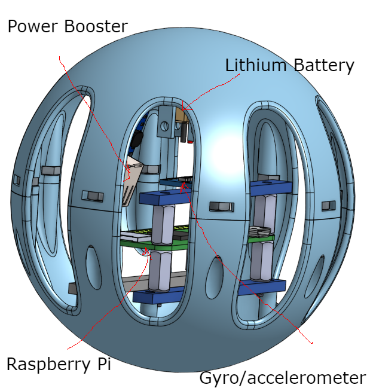

# EG4_Trebuchet
Trebuchet. Up the reds

## Table of Contents

- [CAD](https://github.com/omckenn37/EG4_Trebuchet/blob/main/README.md#cad)
  * [Capsule](https://github.com/omckenn37/EG4_Trebuchet/blob/main/README.md#capsule)
    + [Top Shere](https://github.com/omckenn37/EG4_Trebuchet/blob/main/README.md#top-sphere)
    + [Bottom Sphere](https://github.com/omckenn37/EG4_Trebuchet/blob/main/README.md#bottom-sphere)
    + [Assembly](https://github.com/omckenn37/EG4_Trebuchet/blob/main/README.md#assembly)
    + [Reflections](https://github.com/omckenn37/EG4_Trebuchet/blob/main/README.md#reflections)
  * [Trebuchet](https://github.com/omckenn37/EG4_Trebuchet/blob/main/README.md#trebuchet)
    + [Basic Joints and Connection Pieces](https://github.com/omckenn37/EG4_Trebuchet/blob/main/README.md#basic-joints-and-connection-pieces)
    + [3D Printed Joints](https://github.com/omckenn37/EG4_Trebuchet/blob/main/README.md#3d-printed-joints)
    + [Finger Piece](https://github.com/omckenn37/EG4_Trebuchet/blob/main/README.md#finger-piece)
    + [Release Mechanism](https://github.com/omckenn37/EG4_Trebuchet/blob/main/README.md#release-mechanism)
    + [Axle Cap](https://github.com/omckenn37/EG4_Trebuchet/blob/main/README.md#axle-cap)
    + [Other Components](https://github.com/omckenn37/EG4_Trebuchet/blob/main/README.md#other-components)
    + [Full Trebuchet Assembly](https://github.com/omckenn37/EG4_Trebuchet/blob/main/README.md#full-trebuchet-assembly)
- [Code](https://github.com/omckenn37/EG4_Trebuchet/blob/main/README.md#code)
- [Physical Assembly](https://github.com/omckenn37/EG4_Trebuchet/blob/main/README.md#physical-assembly)
- [Results](https://github.com/omckenn37/EG4_Trebuchet/blob/main/README.md#results)

## CAD
### Capsule
#### Top Sphere:

  
  

This is the top half of the sphere when assembling. This will contain the pieces that supports the raspberry pi, altimeter, and gyro/accelerometer. The three rectangular prisms are pieces we converted to laser cut peices so we can try to save as much material as we can. All those pieces will be held in place by standoffs and at the bottom screwed in directly into the sphere structure. The right image the slot that the screw will insert in and go threw to the other half of the sphere and screw the together. This is drilled into the sphere so there is nothing perturding from the spherical shape.

#### Bottom Sphere

  
  

This is the bottom half of the sphere when assembling. This will contain the battery and power booster. The bottom ovalish extruded piece is what will hold the battery it has been made to match the shape with a bit of padding. The piece to the side of that is the holder of the power booster it has been made so it is at an angle so it saves space by optimizing on the curved shape of a sphere. The right image is an extrusion along the inside of the capsule walls it forms a correlating slot that will direct the screw into a gap where we can slide the nut into and screw the capsule together.

#### Assembly

  
  
  
  

The first image displays the assembly without the top circle and displays the pi components floating in the air and you can see the screws going into their slots and can see the battery and power booster screwed in under them. The second picture displays the assembly without the bottom circle and shows the screwed-in battery and power booster while the pi components are floating and you can see the floating nuts and the screw extruding from its slot. Lastly, the final image is the completed assembly you can see the entire assembly we extruded the sides to make an almost Wiffle-ball-like shape so that it saves as much material as possible and we also added the screw and nut portion without messing with the sphere shape.
 

#### Reflections 
First Off, Spheres are very annoying to work with because for every extrusion you have to make a plane since there is no flat surface that you can select on a sphere. This was our first project with Onshape so we did learn some new functions that we didn't know. I have used a lot of circular patterns and mirrors in this assignment and how to use the in sketch version which does not bring up a menu it creates pop-ups similar to a smart dimension. A cool feature we discovered is the app store that we never really noticed: the App Store, although we haven't used it much and a lot of the programs aren't free, there do seem to be some possible programs that can render your CAD to get better images for documentation and also programs similar to SolidWorks stress test. Also, we learned how to make the drawings used to laser cut parts. Another thing I learned is using a bit of trigonometry to get chamfers to be at an angle you desire.

---

### Trebuchet

#### Basic Joints and Connection Pieces

  
  
  
  

Originally, the plan for our joints and other various connection pieces was to make 4-6 3d printed joints that would join 2-3 pieces of alumminum extrusion together. We had originally decided to make the joints fully 3d printed as ABS material is quite stronger than acrylic. However, after testing the strength of a few laser cut joints, we realized they would probably be strong enough if we paired up 2 acrylic pieces on each joint and made sure to provide enough mounting holes. As you can see in the pictures above, there are 3 different types of laser cut joints that we used; the left-most takes a boomerang-like shape and is curved at a 68 degree angle, the middle joint allows the pivot beam to connect to the cross beam, and the joint on the right allows two beams to be joined at a 90 degree angle. To allow for maximum strength, we use two joint pieces for each connection, one on each side of the alumminum bars. 

#### 3D Printed Joints

  
  
  

These joints are the only 3d printed joints that we used on our trebuchet. TThe left and center pictures show the bearing joing. This piece takes in two beam connections at a 44 degree angle and connects them together while additonally allowing a bearing to be pushed into the circular cutout. This specifc joint had to be 3d printed as we wouldn't have been able to properly integrate the bearing with laser cut pieces. The picture on the right shows our counterweight holder. We opted to 3D print this piece rather than laser cut it as it will be directly holding up our counterweight, which is rouhgly 35 pounds. To make sure that this piece didn't break or shatter during testing, we figured 3D printing it was a smart move. 

#### Finger Piece

  
  
  
  

The finger piece and finger assembly connects to the long arm of the pivot beam an and allows the angle of release for the pouch to be adjusted. Essentially, the angle at which the release string is attached to the finger piece determines at what time during the launch the string releases, impacting the launch angle of the payload. Because of this, we felt that we should make this piece able to swivel along one axis so that during testing, we could adjust the release angle with ease. The metal finger is able to swivel roughly 45 degrees, giving us plenty of room for adjustments. 

#### Release Mechanism
The release mechanism is comprised of 3 3D printed linkages, a metal rod, and a servo. To set up the launch mechanism, we will pull astring around the mtal rod and connect it permanantly to the other side of the trebuchet. When the servo rotates, the metal rod is pulled out which creates space for the string to release. Additionally, we will add a simple raspberry pi control box that will allow us to control the servo remotely, meaning we can hook up a launch button to our flask site.

#### Axle Cap

The axle cap allows the 20x20mm extrusion to rotate freely inside the main swivel bearings. The piece connects to the extrusion with one screw and essentially converts the cube shape of the beam into a circular shape that fits into the bearing, allowing the beam to rotate inside the bearing which gives our launch very smooth movement. 

#### Other Components

##### 20x20mm Alumminum Extrusion

Our main frame of the trebuchet was built using 20x20mm alumminum extrusion that we found in the back of the lab. Originally, we planned on buying wooden planks but upon finding these we figured they were a much better option considering they were significantly smaller yet very strong. To construct our frame, we cut this extrusion into 1100mm, 800mm, 600mm, 400mm, and 207mm lengths. 

##### Nuts & Bolts

To connect the alumminum extrusion to our various laser cut and 3D printed components, we used M5 6mm bolts and M5 T-slot nuts that we found with the alumminum extrusion. These nuts and bolts allowed us to have incredibly secure connection between parts and helped us achieve a very rigid trebuchet structure. 

##### Bearings

To make sure that our pivot arm had smooth movement, we decided to incorporate bearing into our design. We ended up using 30x47x9mm bearings as they allowed for the extrusion to fit inside of them with a bit of wiggle room, meaning we could design and use a piece like the axle capt to make sure the beams were able to rotate freely inside the bearings.

##### Steel Rod

We used 5mm steel rod for the finger as well as to hold our counterweight string as it had a small diameter and could hold quite a bit of weight. 

#### Full Trebuchet Assembly

The final CAD assembly of the trebuchet combines all of the listed components into one seamless assembly. The counterweight and payload pouch are not included in the CAD as they are very difficult to model, but they would connect to the finger assembly and the counterweight piece. 

---

## Code

## Physical Assembly

## Results
