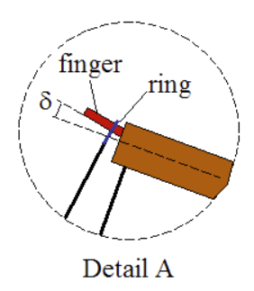

# EG4_Trebuchet
Trebuchet. Up the reds

## Planning

### Trebuchet Basics

Trebuchets are ancient siege weapons that utilize a counterweight to launch a projectile great distances. They are pretty much catapults except they use a counterweight rather than some sort of spring or rubber band. The counterweight’s falling motion propels the payload upward as it will eventually release it’s payload. The counterweight needs to be a shorter distance from the central pivot point than the payload so that the payload will reach its highest possible velocity. 

  
  

[Link](https://www.real-world-physics-problems.com/trebuchet-physics.html) to pictures.

### Materials

| Material  | Quantity |
| ------------- | ------------- |
| Raspberry Pi Zero  | 1 |
| Accelerometer | 1 |
| Altimeter | 1 |
| Lipo Battery | 1 |
| Power booster | 1 |
| USB-A to microUSB power cable | 1 |

### Code Goals

| What?  | Why? | Have we learned this in the assignments? |
| ------------- | ------------- | ------------- |
| Take Acceleration Values  | So we can find the accerlation over time, to help record the flight model| Yes |
| Find Displacement | So we can find the roots of the equation of the flight, and know distance, to help find the equation of the flight  | No |
| Take Altitude (and Max Altitude) | So we can find the max of the flight, to help find the equation of the flight | No, but we have an altimeter |
| Find time in air | So we know how long it was in the air | No, but we have the tools |
| Find Max Velocity | So we can find the equation of the flight, and know speed/velocity | Yes |
| Calculate Equation Model | So we can graph the flight, and know all we want about the flight/trajectory | No |
| Graph true flight on Webpage | So we can visually represent the flight -- in what it actually looked liked | Yes |
| Graph equation of flight on Webpage | So we can visually represent the flight -- in what the equation it followed looks like (both graphs should be similar) | No |
| Profit | Become a government contractor for Trebuchets| Of Course |

### Timeline

| Week | Lukas | Owen | Graham |  
| ------------- | ------------- | ------------- | ------------- |
| Feb 22 - Mar 1 |   |  |   |

